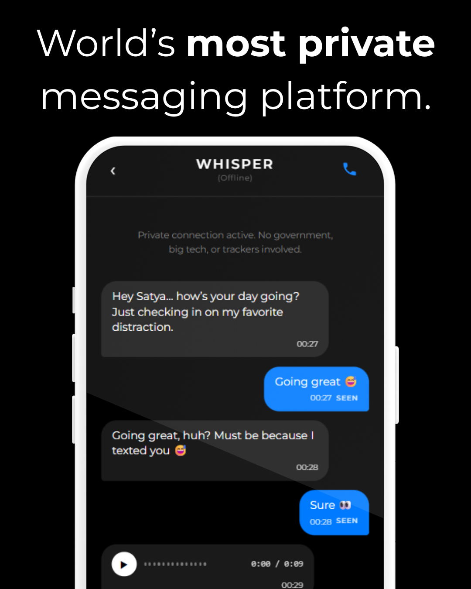
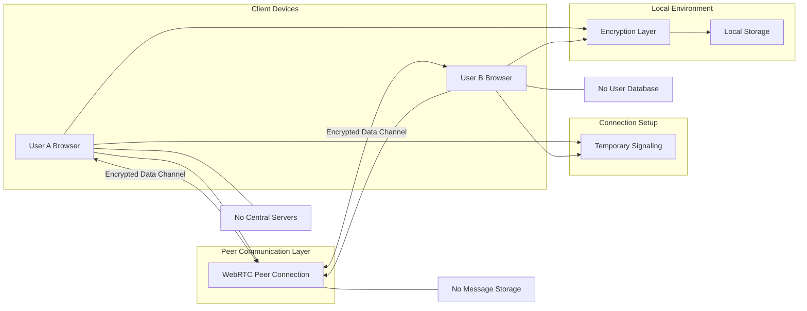

  

<h1 align="center">Whisper | Private Messaging</h1>

A private, peer-to-peer messaging platform with no central servers, no tracking, and no corporate control.

  

  

---

## Overview

Communicate freely with **Whisper**, a messaging platform designed around a simple principle: conversations should belong to the people participating in them, not to corporations, servers, or centralized platforms.

Unlike conventional messaging services that depend on centralized infrastructure, Whisper removes the middle layer entirely. Messages are exchanged directly between devices, eliminating the need to trust large technology companies or data-collecting platforms.

There are no central servers storing conversations, no behavioral analytics tracking activity, and no hidden mechanisms collecting user data.

Whisper is built for people who value private communication and believe digital conversations should remain independent from surveillance, profiling, and centralized control.

---

## Why Whisper Exists

Modern messaging platforms often rely on centralized systems that create multiple risks.

These include:

- Data collection and behavioral profiling  
- Centralized surveillance points  
- Government or corporate pressure  
- Platform dependency  
- Single points of failure  

When communication depends on central infrastructure, privacy becomes optional rather than fundamental.

Whisper removes these risks by eliminating the central authority entirely.

---

## Key Features

🔐 **No Central Servers**  
Messages do not pass through company-owned infrastructure.

🌐 **Peer-to-Peer Communication**  
Devices connect directly to exchange messages.

🚫 **No Tracking**  
No analytics, cookies, or behavioral monitoring.

📭 **No Accounts Required**  
No email, phone number, or personal identity needed.

🛡 **Privacy by Design**  
The architecture itself prevents centralized data collection.

---

## Architecture

Whisper uses a minimal decentralized structure.

| Component | Implementation |
|---|---|
| Servers | None |
| Accounts | None |
| Message Storage | None |
| Data Collection | None |
| Communication Model | Peer-to-peer |

This approach removes central points of surveillance and reduces infrastructure dependency.

---

## Infrastructure

Whisper operates using a decentralized communication model where users connect directly through peer-to-peer channels.  
No centralized infrastructure stores messages, manages identities, or tracks user activity.

### Infrastructure Diagram

## Privacy Model

Whisper follows a **zero-data architecture**.

The platform does not collect, store, or process personal information.

| Category | Data Stored |
|---|---|
| User accounts | None |
| Message history | Not stored |
| Tracking data | None |
| Analytics | None |

Conversations exist only between participants.

---

## Try Whisper

Try Whisper here:  
https://satyapsamal.github.io/whisper/

---

## Philosophy

Privacy should not be treated as an optional feature.

It should be the default condition of communication.

Whisper is built on the belief that people should be able to talk freely without being monitored, analyzed, or controlled by centralized systems.

---

## Project Status

The core functionality of Whisper is complete.

Current development focuses on improving usability, addressing security concerns, fixing bugs, and refining the overall experience.

---

## License

No license has been assigned to this project.  
All rights reserved by the author.
